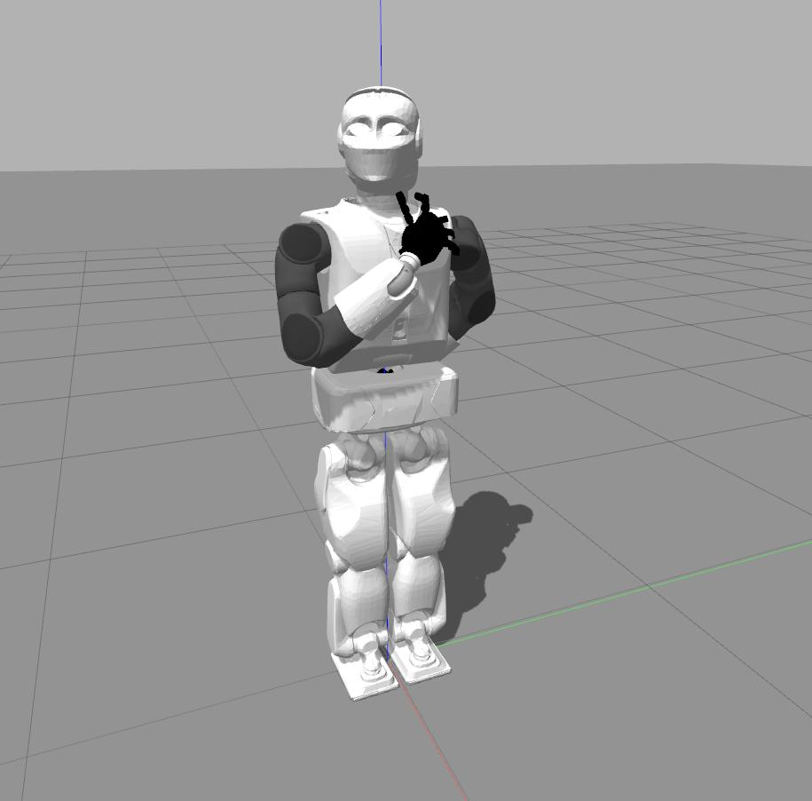

reem_c position manipulation
===========

This node contains a modified version of the **play_motion** node for the reem_c gazebo simulation, including several nodes to develop joint position controlling easily. 

## Instructions

### Installation 
Replace the folder **src/play_motion** with this one, and then recompile using: 

	catkin build play_motion 

### Running
Run the gazebo simulator main node: 

	roslaunch reemc_gazebo reemc_empty_world.launch		
	
then, run the **reemc_controller_configuration** node: 

	roslaunch reemc_controller_configuration joint_trajectory_controllers.launch
	
And finally, run any of the available package nodes described below.	
	
## Available nodes

**Yaml-control**

This node allows to manipulate the joints of the reemc according a desired articulation. 

	roslaunch play_motion yaml_position.launch	 
	
Modify the file **play_motion/config/position.yaml** according the desired robot articulations. 

<figure class="image">

<figcaption> Figure1: ReemC model reaching positions provided in yaml file.</figcaption> 
</figure>

**Note:** For any articulation, all the joint names are required. To consult which joints are available for every controller run: 

	rosservice call /controller_manager/list_controllers
	
**Position subscriber**

This node allows to read the desired joints positions from a topic, and then apply it to the reemc using the **joint_trajectory_controller**. 

	roslaunch play_motion position_subscriber.launch	 
	
You need to generate a topic with the following properties: 

	name: "/reemc/positions" 
	type: whole_body_state_msgs::WholeBodyState
	
an example of how to generate the topic is provided in the **src/position_publisher.cpp** node: 

	roslaunch play_motion position_publisher.launch

## To Do List 

* Enable speed and force control 
 
## Contributors

* Edgar Macías García (edgar.macias@cinvestav.mx)
* Niger Chel Puc (Abram.Puc@cinvestav.mx)
* Fernando Ojeda de Ocampo (fernando.deocampo@cinvestav.mx)
