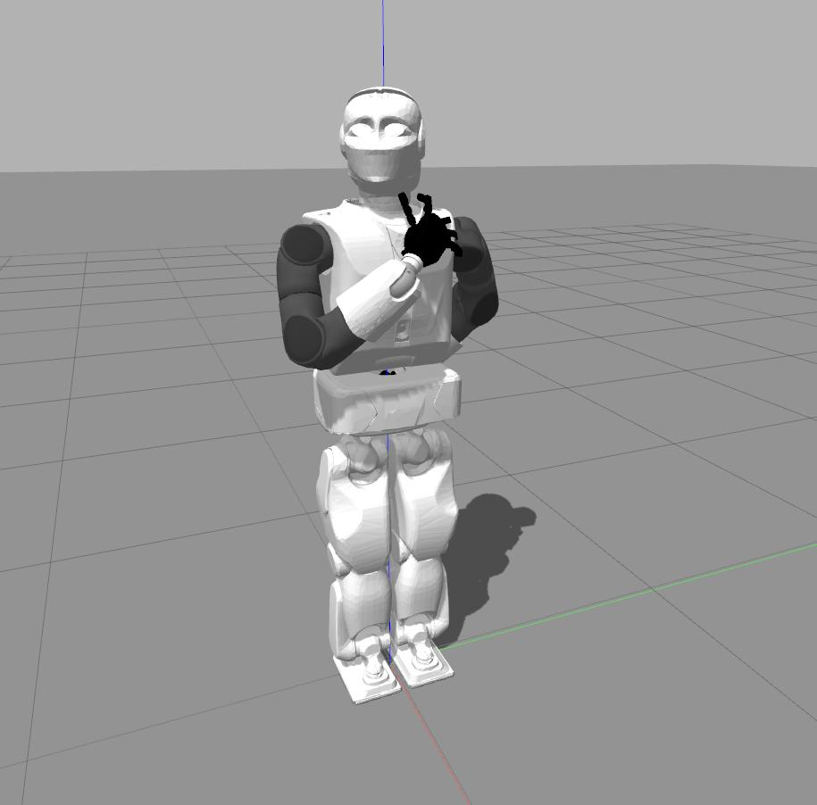

reemc callback controllers
===========

This node contains several implementations to manipulate the reemc humanoid robot through position and effort controllers

## Instructions

### Installation 
Place this folder on the **reemc_ws/src** repository, and then compile it: 

	catkin build reemc_controllers

### Running
Run the gazebo simulator main node: 

	roslaunch reemc_gazebo reemc_empty_world.launch		
	
then, run some of the available  controllers: 

	roslaunch reemc_controllers effort_control.launch
	
Prior running the node, modify the file **config/effort_controller_config.yaml** on the topic **joints** with the name of the desired joings to manipulate. 

Finally, generate a message **/reemc/efforts** of type **whole_body_state_msgs::WholeBodyState** with the desired joints names and efforts. 	
	
## Available demos

**Yaml-effort-control**

This node allows to publish the topic  **/reemc/efforts** on real-time using a .yaml file. 

	roslaunch reemc_controllers yaml_effort.launch	 
	
Modify the file **config/effort_manipulation.yaml** according the desired robot articulations. 

<figure class="image">

<figcaption> Figure1: ReemC model joint's manipulation.</figcaption> 
</figure>
	
## To Do List 

* Enable callback topic reading for position control.
 
## Contributors

* Edgar Macías García (edgar.macias@cinvestav.mx)
* Niger Chel Puc (Abram.Puc@cinvestav.mx)
* Fernando Ojeda de Ocampo (fernando.deocampo@cinvestav.mx)
